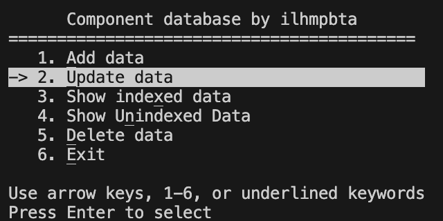
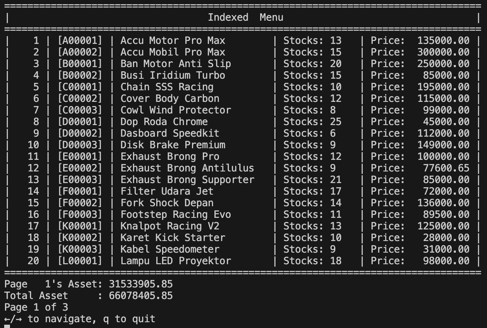
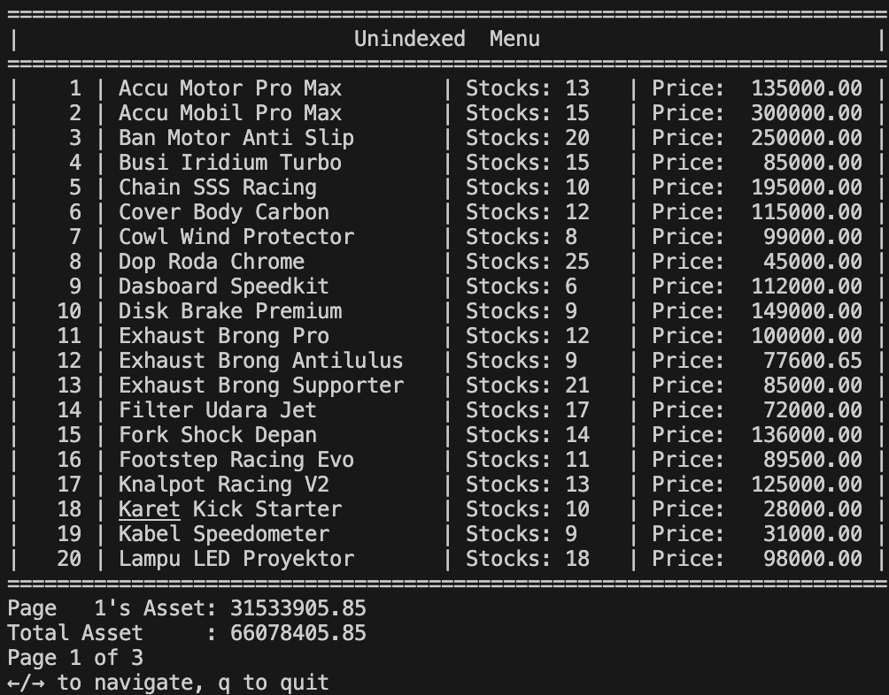

# Final Project

This is the final projecct I have made for my early 2025 data structure class. We have to fulfill the criteria given down below:

<hr>

Make a database program with **C** language which stores data using binary files fulfilling these criteria:
- Component ID (6 digit string)
- The component (item name)
- How many of the items are avaibale
- Unit price

And with those criteria, make at least 50 records of data in which the menu will include:
1. <u>A</u>dd data
2. <u>U</u>pdate Data
3. Show inde<u>x</u>ed data
4. Show u<u>n</u>indexed data
5. <u>D</u>elete data
6. <u>E</u>xit

Menu can be interacted with using numbers (1-6), <u>underlined</u> letters (in this case it's: a, u, x, n, d, e), and with arrow keys (↑ / ↓).
<hr>

## How to run

If you are insterested in running this said program, the prequisite is that you must run it with a POSIX architecture (Linux or MacOS) and have the makefile extension installed with the step being:
1. Clone this repository or just download this whole folder
2. Go to the folder's directory using the terminal
3. Call `make` or `	gcc -Iinclude -Wall src/avl_lib.c fp.c -o main`
4. Run with `./main`
5. Follow the instruction within the menu

## Breaking it down

Based on those criteria and the fact that I am currently using a POSIX architecture, I will be using unistd.h and termios.h for the menu inputs (conio.h is only available for Windows, a DOS architecture). These are the plans:

### AVL (Adelson Velsky Landis) Tree as the backend

Since we're playing with a lot of data and with the option to show it by index (which means we need ordered data), I choose AVL Tree because it is the most suitable for it. It ensures the speed of data insertion and search to be O(log n) complexity. Which will happen frequently as the data grows.

- **Why not use BST (binary search tree)?**
    
    The reason as to why I avoid binary search tree is due to the fact that it has potential to be a skewed tree, and we do not want that to happen when we're trying to manage a large amount of data, so AVL it is.

- **Why not use linear data structure (deque, priority deque)?**

    This one might goes without saying, but the traversal for these data structures are not the best for data insertion and search. For priority queue the worst case might be O(n) and for double ended ones just reduces it to O(n/2).

The node will be declared in [avl_lib.h](./include/avl_lib.h) and the function is implemented in [avl_lib.c](./src/avl_lib.c)

```c
typedef struct AVLNode_t {
    Komponen data;
    int height;
    struct AVLNode_t *left, *right;
} AVLNode;

typedef struct AVL_t {
    AVLNode *_root;
    unsigned int _size;
} AVL;
```

How this backend will work is that whenever this program is executed, the data from [data.bin](./src/data.bin) will be loaded into the declared AVL data structure within the program. THe rest will work with the magic of data structure.

### The struct

We will be storing soome data, to make it easier to manage, we will use struct as declared in [avl_lib.h](./include/avl_lib.h):
```c
typedef struct {
    char no_komponen[7];    // component ID
    char nama[26];          // item name
    int stok;               // stock amount
    long double harga;      // price
    int id;                 // the processed component ID string for AVL index
} Komponen;
```


### The menu

Currently the criteria for the menu was that
> Menu can be interacted with using numbers (1-6), <u>underlined</u> letters (a, u, x, n, d, e), and with arrow keys (↑ / ↓).

And thus the breakdown is that we will be
- **Arrow handling**

    Arrow keys are defined as escape character here, hence why it started with `'\033'` and here if it ends with `A` that means it is an arrow up (↑), and as long as the current position is bigger than 1, the position will be repositioned (if not, it will go out of bounds). But if it is `B`, that means it is an arrow down (↓) and yeah, same boundary rule apply here.

    ```c
    if (c == '\033') {
    char seq[2];
        if (read(STDIN_FILENO, &seq[0], 1) == 0) continue;
        if (read(STDIN_FILENO, &seq[1], 1) == 0) continue;

        if (seq[0] == '[') {
            if (seq[1] == 'A' && pos > 1) pos--;
            else if (seq[1] == 'B' && pos < MENU_LEN) pos++;
        }
    }
    ```

- **Number handling**

    It is quite straightforward:
    ```c
    if (c >= '1' && c <= '6') pos = c - '0';
    ```

- **Key (<u>underlined</u>) letter handling**

    In C, you can't just use html syntax `<u> word </u>` to underline a word. Hence we use the ANSI code which starts with `\033[4m` and ends with `\033[24m`. Then, to handle inputs in which they pressed the key letter, we can use a loop based array that coressponds which number is which like this
    ```c
    const char hotkeys[MENU_LEN] = {'a','u','x','n','d','e'};
    for (int i = 0; i < MENU_LEN; ++i)
        if (c == hotkeys[i] || c == hotkeys[i] - 32) pos = i + 1;
    ```

    This wil return the menu number corresponding to the placement of the keywords in the array, and also it will be case insensitive (The -32 in the ends due to A starting in hex 40 and 'a' starting in hex 60) so that you can still use the menu if your caps-lock is accidentally turned on.

- **Inverter (just an accessory)**

    Basically the current menu loops through this array of char
    ```c
    const char* menu_items[MENU_LEN] = {
        "\033[4mA\033[24mdd data                             ",
        "\033[4mU\033[24mpdate data                          ",
        "Show inde\033[4mx\033[24med data                    ",
        "Show U\033[4mn\033[24mindexed Data                  ",
        "\033[4mD\033[24melete data                          ",
        "\033[4mE\033[24mxit                                 "
    };
    ```

    - **Why is there an extra space after the menu?**
    
        Those are just consmetic, I plan on using ansi code to invert the color for the selected menu as the indication in which the menu is being selected appear as such. check this out:

        
        
        Without the extra spaces, the white lines covering the selected area will only extend until the last letter, so white spaces here helps lights up the next few blocks after the menu item.

- **Indexed and unindexed menu**

    This one is a little bit weird to explain, the menu divides itself into `3. Show undexed data` and `4. Show uninexed data`, what exadctly is the difference?

    - Indexed menu
    
        As the title described, we will show the menu with it's index, here being the component ID. So this is what it looks like:

        

    - Uninexed menu

        Exactly as what the title implied, it is unindexed, so the table looks less wide compared to the indexed one.

        

- **Other menus**

    The other menu is just a sequence of scanf which is stored in temporary variable so that it does not break/ruin the other variable when an overflow occur.


### The data handling

Everything will be stored by appending the new data to the [data.bin](./src/data.bin) file and will also have a backup which stores all data everytime you picked menu number 6 (Exit) into [data_backup.bin](./src/data_backup.bin) (just a helpful backup when something goes wrong during the program runtime in which you can interrupt the terminal with `Ctrl + C` and use this backup to restore the data)

- **Write - append function**

    This function in particular will be called every time the `1. Add data` menu is accessed.
    ```c
    void append_to_file(const Komponen *k) {
        FILE *f = fopen(filepath, "ab");
        if (!f) return;
        fwrite(k, sizeof(Komponen), 1, f);
        fclose(f);
    }
    ```

- **Backup - overwrite function**

    This sequence will be called whenever the user picked menu number 6: `6. Exit` in which it will dublicate the file (it will rewrite the data and overwrite it).
    ```c
    FILE *src = fopen(filepath, "rb");
    FILE *dest = fopen(backup, "wb");
    if (src && dest) {
        char buffer[1024];
        size_t n;
        while ((n = fread(buffer, 1, sizeof(buffer), src)))
            fwrite(buffer, 1, n, dest);
        fclose(src);
        fclose(dest);
    }
    ```

---

## Summary

| Path | Description  |
| :-----: | :--------: |
| [fp.c](./fp.c) | The main program used for the menu and logic flow |
| [makefile](./makefile) | It exist as a QOL so that you can compile the program immidiately using the command `make` without having to remember the paramters, granted this program can only be compiled with POSIX architecture. <br>Using the `make` command will create an executable file called `main` and you can open it with `./main` |
| [./include/avl_lib.h](./include/avl_lib.h) | The declarations so that it could be included as a library for the main program |
| [./src/avl_lib.c](./src/avl_lib.c) | The implementation for `avl_lib.h` using C language |
| [./src/data.bin](./src/data.bin) | Where the data is being stored |
| [./src/data_backup.bin](./src/data_backup.bin) | The backup data |
| [./assets](./assets/) | Images being shown in the readme |

That's pretty much what I had implemented for the final project program. I might modify it later as I become more experienced in program designing and/or data handling.
